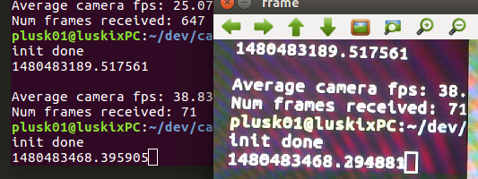

ROS Camera Latency
==================

Measures the acquisition time of a camera using OpenCV and ROS.

---------------------------

Often it is useful to know the latency between when video is taken and when it is received in code. This simple ROS node aims to help quickly measure that. By starting a clock with nanosecond precision in the terminal, you are able to use the camera to record the terminal's clock. Then, you can press `p` (with the video feed window focused) to pause the feed and the clock in the terminal, thus allowing you to take the difference of the two numbers, thus finding the latency. It would be wise to take a few samples and average them to get a better estimate of transfer latency. Below is an example of a camera with ~100ms of latency.

### Running the Code ###

There are two nodes included in this package: `record.py` and `play.py`.

#### record.py ####

This node does the work of showing the video feed and starting the terminal clock for you to measure latency with. Press `p` to pause and `q` to quit (with the feed window focused). This node also uses `cv_bridge` to publish the image as an `Image` ROS message so you can measure the frequency of the messages that are published (`rostopic hz img`). This camera/ROS setup published at ~30fps, although the node calculates that captures are happening at ~35fps. I'm not entirely sure why this discrepency exists -- it seems like no images are dropped during transmission.

 It is also interesting to compare with `rostopic echo /img/header` to see the timestamps of each image in the video sequence.

#### play.py ####

This node subscribes to the `/img` topic and finds the transmission latency in milliseconds. This is the current ROS time minus the time of image capture (embedded in the header of the `img` message). You can have this node plot the latency over time by setting `SHOW_PLOT = True`. The transmission delay of the example camera with the two nodes on the same machine was ~1.5ms.